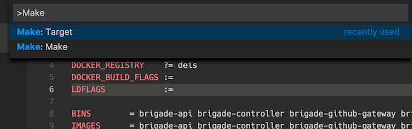
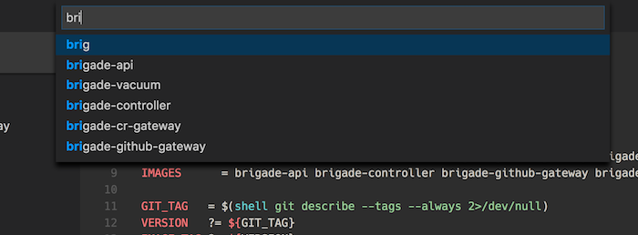

# Make: A VS Code extension for working with `make`

Many programming languages, such as C and Go, still rely upon `Makefile`s to handle builds. This extension provides features to ease working with Make in VS Code.

## Features

- Run any `Makefile` target with ease. Just run CMD-SHIFT-P and type `make`. You will be prompted for a target.
- Don't remember all your `Makefile` targets? Run CMD-SHIFT-P `target` and you will be prompted with a list.

## Requirements

- A version of `make` that supports table printing with `-p`.
- Currently, this is only tested on macOS, though it should work on Linux. Untested on Windows.

## Known Issues

- Currently all of our issues are unknown. :smile:

## Release Notes

### 1.0.0

Initial release of `Make` extension.

### 1.0.1

Icon added

## Notes

Icon CC BY-NC-ND 2.5 https://www.iconfinder.com/icons/9109/advanced_makefile_options_settings_setup_text_icon